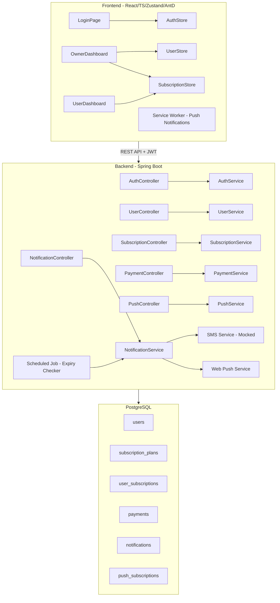
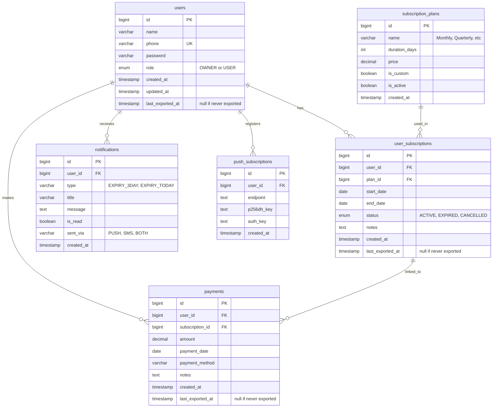
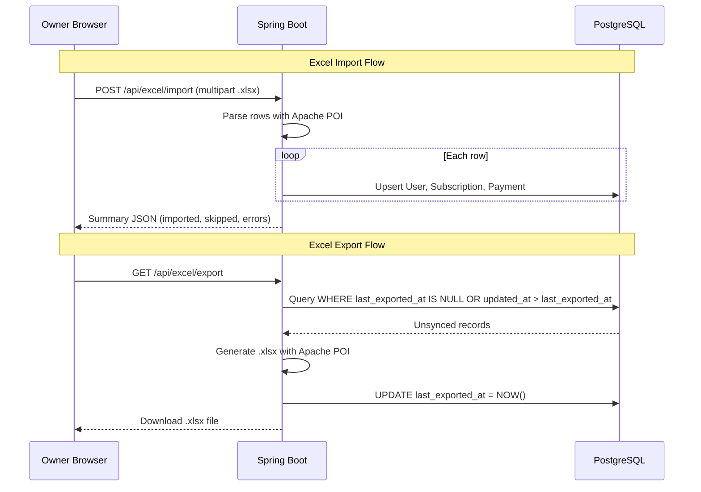
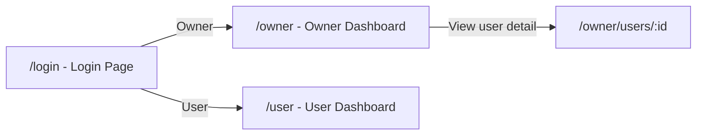
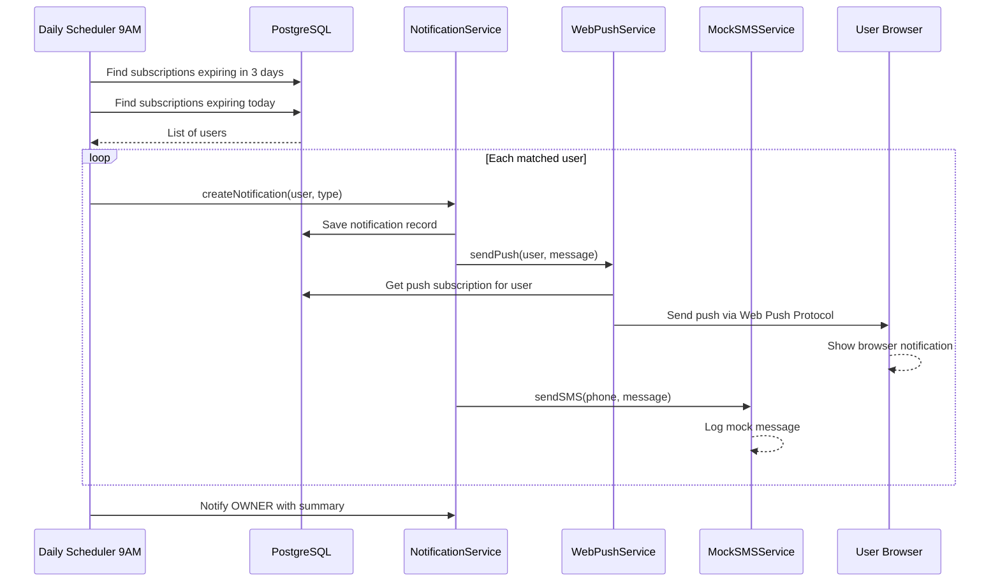

# Gym Management Full-Stack App

## Architecture Overview



---

## 1. Project Structure

```
gym-management/
├── frontend/                    # React + TypeScript + Vite
│   ├── public/
│   │   └── sw.js                # Service worker for push notifications
│   ├── src/
│   │   ├── api/                 # Axios instance + API functions
│   │   ├── components/          # Reusable AntD-based components
│   │   ├── pages/               # Login, OwnerDashboard, UserDashboard
│   │   ├── stores/              # Zustand stores (auth, users, subscriptions, notifications)
│   │   ├── hooks/               # Custom hooks (useDebounce, usePushNotifications)
│   │   ├── types/               # TypeScript interfaces
│   │   ├── utils/               # moment.js helpers, constants
│   │   ├── App.tsx
│   │   └── main.tsx
│   └── package.json
│
├── backend/                     # Spring Boot
│   └── src/main/java/com/gym/
│       ├── config/              # SecurityConfig, WebPushConfig, CorsConfig
│       ├── controller/          # REST controllers
│       ├── dto/                 # Request/Response DTOs
│       ├── entity/              # JPA entities
│       ├── repository/          # Spring Data JPA repos
│       ├── service/             # Business logic
│       ├── scheduler/           # Scheduled tasks (expiry checker)
│       ├── security/            # JWT filter, auth provider
│       └── exception/           # Global exception handler
│
└── docker-compose.yml           # PostgreSQL + app services
```

---

## 2. Database Schema



### Seed Data (subscription_plans)

| name        | duration_days | price        | is_custom |
| ----------- | ------------- | ------------ | --------- |
| Monthly     | 30            | (owner sets) | false     |
| Quarterly   | 90            | (owner sets) | false     |
| Half-Yearly | 180           | (owner sets) | false     |
| Yearly      | 365           | (owner sets) | false     |
| Custom      | (owner sets)  | (owner sets) | true      |

---

## 3. Backend Implementation (Spring Boot)

### 3.1 Authentication (JWT)

- **POST `/api/auth/login`** - Phone + password login, returns JWT token with role
- **POST `/api/auth/register`** - Owner-only: creates a new user account
- JWT contains: `userId`, `role`, `phone`
- `SecurityConfig` uses `OncePerRequestFilter` to validate JWT on every request
- BCrypt for password hashing
- Role-based access: `@PreAuthorize("hasRole('OWNER')")` on owner-only endpoints

### 3.2 User Management (Owner only)

- **GET `/api/users?search={text}&page={n}&size={s}`** - Search users by name OR phone (SQL `LIKE` on both columns), paginated. This powers the debounced dropdown search on the frontend.
- **GET `/api/users/{id}`** - Get user details (owner: any user, user: self only)
- **PUT `/api/users/{id}`** - Update user details (name, phone, password reset)
- **DELETE `/api/users/{id}`** - Soft delete / deactivate user

### 3.3 Subscription Management

- **GET `/api/users/{userId}/subscriptions`** - List all subscriptions (history) for a user
- **POST `/api/users/{userId}/subscriptions`** - Owner creates a new subscription for a user. Request body:

```json
{
    "planId": 1,
    "startDate": "2026-03-11",
    "endDate": "2026-04-10",
    "customDurationDays": null,
    "notes": "First month free promo"
}
```

```
- If `planId` refers to the "Custom" plan, `endDate` or `customDurationDays` is required
- For predefined plans, `endDate` is auto-calculated from `startDate + plan.durationDays`
- Automatically marks previous ACTIVE subscription as EXPIRED
```

- **GET `/api/subscription-plans`** - List all available plans
- **GET `/api/users/{userId}/subscriptions/current`** - Get current active subscription with days remaining

### 3.4 Payment Management

- **GET `/api/users/{userId}/payments`** - List payment history for a user
- **POST `/api/users/{userId}/payments`** - Owner records a payment:

```json
{
    "subscriptionId": 5,
    "amount": 2000.0,
    "paymentDate": "2026-03-11",
    "paymentMethod": "CASH",
    "notes": "Paid in full"
}
```

### 3.5 Notification System

- **GET `/api/notifications`** - Get current user's notifications (paginated)
- **PUT `/api/notifications/{id}/read`** - Mark notification as read
- **POST `/api/push/subscribe`** - Register browser push subscription (stores endpoint, p256dh, auth keys)

### 3.6 Scheduled Expiry Checker

A `@Scheduled` cron job runs **daily at 9:00 AM**:

1. Query `user_subscriptions` where `status = ACTIVE` and `end_date = today + 3 days` --> send "3 days left" notification
2. Query `user_subscriptions` where `status = ACTIVE` and `end_date = today` --> send "expired today" notification and mark status as EXPIRED
3. For each matched user:

- Create a `notifications` record
    - Send Web Push notification via `WebPushService` (using `web-push` library / `nl.martijndwars:web-push` Java library)
    - Call `SMSService.send()` (mocked -- just logs the message)

1. Also sends a summary push notification to the OWNER: "X users expiring in 3 days, Y users expired today"

### 3.7 SMS Service (Mocked)

```java
public interface SMSService {
    void sendSMS(String phoneNumber, String message);
}

@Service
@Profile("default")
public class MockSMSService implements SMSService {
    @Override
    public void sendSMS(String phone, String message) {
        log.info("[MOCK SMS] To: {}, Message: {}", phone, message);
    }
}
```

When ready to integrate real SMS (e.g., Twilio), create a new implementation with `@Profile("production")`.

### 3.8 Excel Import / Export (Apache POI)

#### Import (One-time migration) -- `POST /api/excel/import`

- Owner uploads a `.xlsx` file via multipart form data
- Expected columns: **Name | Phone | Plan Name | Start Date | End Date | Amount Paid**
- For each row, the backend:
    1. Creates a `User` record (role=USER, password = BCrypt hash of last 4 digits of phone + "gym", e.g., `6789gym`)
    2. Matches `Plan Name` to a `subscription_plans` record (fuzzy match: "monthly" -> Monthly). If no match, creates a Custom plan entry.
    3. Creates a `UserSubscription` with the start/end dates, marks as ACTIVE if `end_date >= today`, otherwise EXPIRED
    4. Creates a `Payment` record with the amount and `payment_date = start_date`
- Skips rows where phone number already exists (avoids duplicates), returns a summary: `{ imported: 45, skipped: 3, errors: [{row: 12, reason: "missing phone"}] }`

#### Export (Incremental) -- `GET /api/excel/export`

- Owner clicks "Export to Excel" button
- Backend queries all records where `last_exported_at IS NULL` or `updated_at > last_exported_at` across users, subscriptions, and payments
- Generates a `.xlsx` file with columns: **Name | Phone | Plan Name | Start Date | End Date | Status | Amount Paid | Payment Date | Payment Method**
- After generating the file, updates `last_exported_at = NOW()` on all exported records
- Returns the file as a downloadable response (`Content-Disposition: attachment`)
- If no unsynced records exist, returns a 204 No Content with a message



### 3.9 Database Backup (Google Drive + rclone)

A system-level backup mechanism to ensure data safety:

- **Bash Script**: A custom script that executes `pg_dump` against the running PostgreSQL container/instance to create a timestamped database dump.
- **Rclone Sync**: The script uses `rclone` (configured with a Google Drive remote) to securely upload the dump file to a cloud folder.
- **Cron Job**: A daily cron job (e.g., `0 2 * * *` for 2:00 AM) triggers the backup script automatically.
- **Retention**: The script will optionally prune local/remote backups older than a certain threshold (e.g., 7 or 30 days) to manage storage space.

---

## 4. Frontend Implementation (React + TypeScript + Zustand + AntD)

### 4.1 Pages and Routing



- `ProtectedRoute` component checks JWT and role
- Redirect based on role after login

### 4.2 Zustand Stores

- `**useAuthStore**` - token, user info, login/logout actions
- `**useUserStore**` - user list, search results, selected user, search action (debounced API call)
- `**useSubscriptionStore**` - subscriptions, current plan, payments for selected user
- `**useNotificationStore**` - notifications list, unread count, mark as read

### 4.3 Owner Dashboard Page

- **Top bar**: Notification bell icon (AntD `Badge` + `Popover`) showing unread count
- **Search bar**: AntD `Select` with `showSearch`, `filterOption=false`, `onSearch` triggers debounced (300ms) API call to `GET /api/users?search=...`. Dropdown shows matching users (name + phone).
- **User table**: AntD `Table` showing all users with columns:
    - Name, Phone, Current Plan, End Date, Days Left (color-coded: green > 7 days, orange 3-7 days, red < 3 days), Status
    - Days left calculated using `moment(endDate).diff(moment(), 'days')`
- **On selecting a user** (click row or select from search): Navigate to user detail page
- **Excel buttons** (top-right area of dashboard):
    - "Import from Excel" button: Opens AntD `Upload` modal (accepts `.xlsx` only), calls `POST /api/excel/import`, shows result summary in a notification/modal (X imported, Y skipped, Z errors)
    - "Export to Excel" button: Calls `GET /api/excel/export`, triggers file download. Shows AntD `message.info("No new data to export")` if 204 returned

### 4.4 User Detail Page (Owner View)

- **User info card**: Name, phone, join date, edit button
- **Current subscription card**: Plan name, start date, end date, days remaining (with AntD `Progress` bar), status badge
- **Subscription history**: AntD `Timeline` or `Table` showing all past subscriptions
- **Payment history**: AntD `Table` with amount, date, method, notes
- **Actions**:
    - "Renew / New Subscription" button opens AntD `Modal` with form:
        - Plan type dropdown (Monthly, Quarterly, Half-Yearly, Yearly, Custom)
        - Start date picker (defaults to today or day after current plan ends)
        - End date (auto-filled for predefined, editable for custom)
        - Amount, payment method, notes
    - "Edit User" button opens modal to update name/phone/password

### 4.5 User Dashboard Page

- **My Plan card**: Current plan, start/end dates, days remaining with visual progress
- **Subscription history**: Table/timeline of past plans
- **Payment history**: Table of payments made
- **Notification bell**: Same as owner but only shows own notifications

### 4.6 Web Push Notifications

- **Service Worker** (`public/sw.js`): Listens for `push` events, displays browser notification
- **On login**: Request notification permission, if granted, call `POST /api/push/subscribe` with the push subscription object
- Uses VAPID keys (public key bundled in frontend, private key in backend)
- Notification click opens the app and navigates to relevant page

### 4.7 Debounced Search Implementation

```typescript
// hooks/useDebounce.ts
const useDebounce = (value: string, delay: number = 300) => {
    const [debouncedValue, setDebouncedValue] = useState(value);
    useEffect(() => {
        const timer = setTimeout(() => setDebouncedValue(value), delay);
        return () => clearTimeout(timer);
    }, [value, delay]);
    return debouncedValue;
};
```

AntD `Select` with `mode` for search, using the debounced value to trigger the API call.

---

## 5. Key Libraries and Dependencies

### Backend (Maven)

- `spring-boot-starter-web`
- `spring-boot-starter-data-jpa`
- `spring-boot-starter-security`
- `spring-boot-starter-validation`
- `postgresql` driver
- `jjwt` (io.jsonwebtoken) for JWT
- `nl.martijndwars:web-push` for Web Push notifications
- `org.bouncycastle:bcprov-jdk15on` (required by web-push)
- `lombok`
- `org.apache.poi:poi-ooxml` for Excel (.xlsx) import/export

### Frontend (npm)

- `react`, `react-dom`, `react-router-dom`
- `typescript`
- `zustand`
- `antd`, `@ant-design/icons`
- `axios`
- `moment`
- `vite`

---

## 6. Notification Flow



---

## 7. Implementation Order

The implementation follows a bottom-up approach: database and backend first, then frontend, then notifications last (since they depend on everything else being in place).
